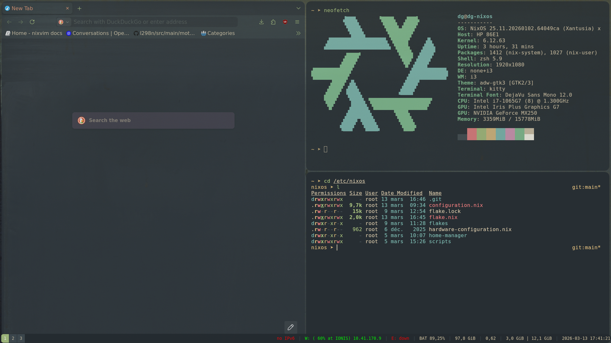
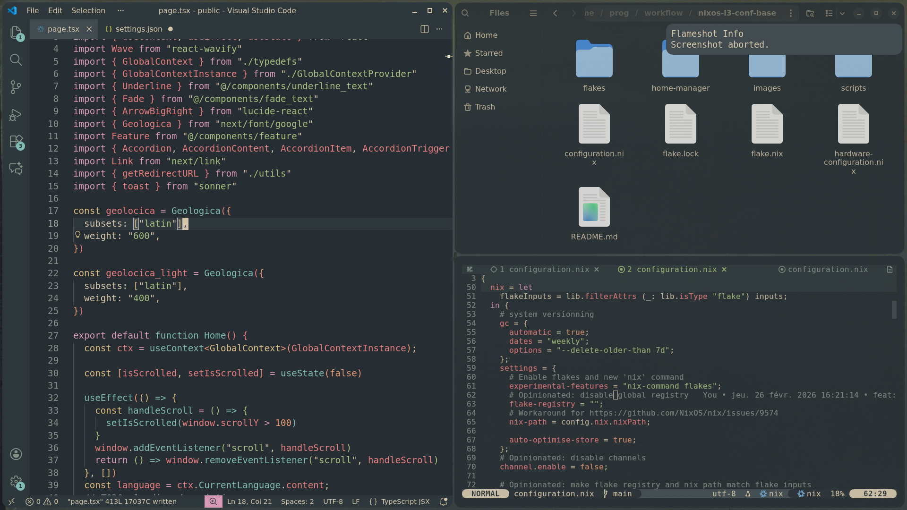

## Install:
remove ./images

replace your username, password and hostname

create a git repository (for versionning with flakes)

copy content of ./nixos to /etc/nixos then rebuild using

``bash
  sudo nixos-rebuild switch --flake /etc/nixos#YOUR_USERNAME
``

## Description

Opinionated nixos base configuration featuring:
  - Theming with stylix
  - i3 window manager
  - Basic scripting to simplify nixos's rebuild process
  - Declarative VSCode, Vim and Neovim configuration using NixVim
  - Declarative Nvidia driver configuration

Based on: https://github.com/Misterio77/nix-starter-configs

Annexe:

